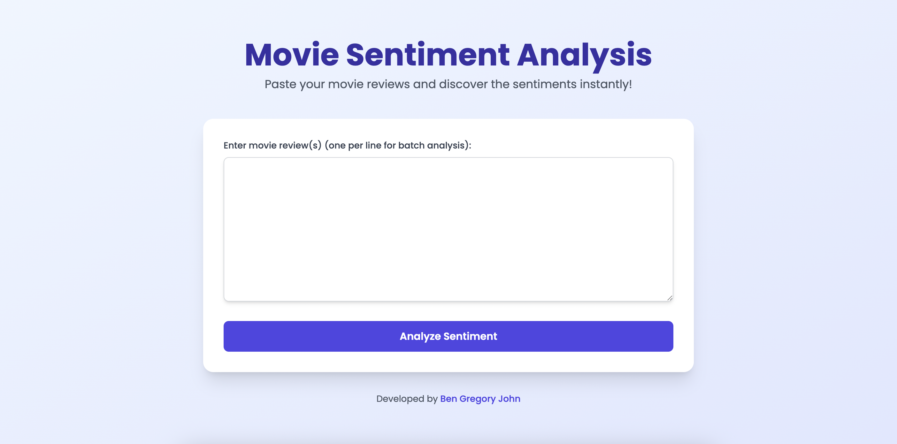
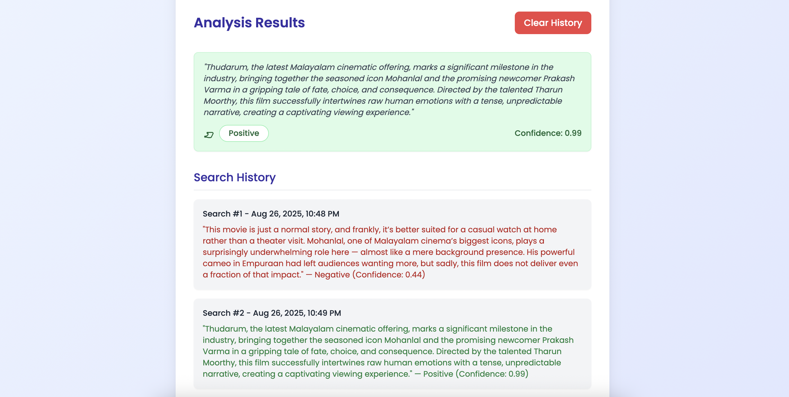

# IMDB Movie Review Sentiment Analysis

This project performs **sentiment analysis** on the **IMDB movie reviews dataset** using **Recurrent Neural Networks (RNN)** and **Long Short-Term Memory (LSTM)** networks. It includes a **production-ready Flask web application** with a **TailwindCSS frontend** to predict whether movie reviews are positive or negative, complete with a user-friendly interface and search history feature.

---

## Problem Statement
Given a movie review (text), predict whether the review is **positive** or **negative**. This is a **binary classification** problem in Natural Language Processing (NLP).

**Dataset Link**: [IMDB Dataset of 50K Movie Reviews](https://www.kaggle.com/datasets/lakshmi25npathi/imdb-dataset-of-50k-movie-reviews)

**Kaggle Notebook Link**: [Movie Sentiment Analysis with LSTM-RNN](https://www.kaggle.com/code/bengj10/sentiment-analysis-with-lstm-rnn-well-explained)

## Sentiment Analyser Overview





---

## Features
- **Model**: Pre-trained LSTM model for accurate sentiment prediction on movie reviews.
- **API**: Flask-based RESTful API to serve predictions, supporting single and batch review inputs.
- **Frontend**: Responsive web interface built with TailwindCSS and Chart.js, featuring:
  - Input textarea for single or multiple reviews.
  - Sentiment results with confidence scores and color-coded badges (green for positive, red for negative).
  - Pie chart for batch review sentiment distribution.
  - Search history to track all predictions within a session, with a clear button (resets on refresh).
- **Tech Stack**:
  - Backend: Flask, TensorFlow, NLTK, NumPy
  - Frontend: HTML, TailwindCSS, Chart.js, JavaScript

---

## Concepts Used

### 1. Word Embedding & Feature Representation
- Raw text is converted into **numeric vectors** using **word embeddings**.
- Embeddings map words into a continuous vector space, preserving **semantic relationships**.
  - Example: *king* → [0.25, -0.63, 0.41, ...]
  - Words with similar meanings have closer embeddings.
- Implemented using Keras `Embedding` layer.

### 2. Recurrent Neural Network (RNN)
- RNNs process **sequential data** like text, capturing dependencies between words.
- Example: In "The movie was not good," the word "not" influences the sentiment.
- Limitation: Suffers from **vanishing gradients**, struggling with long-range dependencies.

### 3. Long Short-Term Memory (LSTM)
- An advanced RNN variant with **gates** (input, forget, output) to control memory flow.
- Benefits:
  - Remembers important context over long sequences.
  - Ignores irrelevant words.
  - Mitigates vanishing gradient issues.
- For sentiment analysis, LSTM captures context like "not" affecting "good" in long reviews.

### 4. Web Application
- **Flask API**: Serves the pre-trained LSTM model, handling text preprocessing and predictions.
- **Frontend**: Responsive UI with TailwindCSS for styling, Chart.js for visualizations, and JavaScript for interactivity.
- **History**: Client-side storage of search history (resets on refresh) with a clear button.

---

## Project Workflow

1. **Data Preparation**
   - Loaded IMDB dataset (50,000 reviews).
   - Tokenized text and padded sequences to a fixed length (maxlen=250).
   - Split into train/test sets.

2. **Model Building**
   - Built RNN and LSTM models with an Embedding layer.
   - Used early stopping to prevent overfitting.
   - Saved the trained LSTM model (`model.h5`) and tokenizer (`tokenizer.pickle`).

3. **API Development**
   - Created Flask endpoints:
     - `/`: Serves the main web interface.
     - `/predict`: Processes single or batch reviews, returns sentiment and confidence scores.
   - Preprocessing includes tokenization, stopword removal, stemming, and padding.

4. **Frontend Development**
   - Designed a responsive UI with TailwindCSS.
   - Added interactive elements: input form, results display, batch summary chart, and search history.
   - Styled with Poppins font and vibrant colors (indigo, green, red).

5. **Training**
   - Optimizer: Adam
   - Loss: Binary Crossentropy
   - Metrics: Accuracy

---

## Model Architecture

**Simple RNN**:
```python
model = Sequential()
model.add(Embedding(10000, 128))
model.add(SimpleRNN(128, activation='relu'))
model.add(Dense(1, activation='sigmoid'))
```

**LSTM (Improved)**:
```python
model = Sequential()
model.add(Embedding(10000, 128))
model.add(LSTM(128))
model.add(Dense(1, activation='sigmoid'))
```

---

## Results

- **Simple RNN**:
  - Test Accuracy: 0.86
  - Test Loss: 0.32
  - Struggled with long reviews due to vanishing gradients.

- **LSTM**:
  - Test Accuracy: 0.88
  - Test Loss: 0.28
  - Improved performance by capturing long-term dependencies.

- **Web App**:
  - Successfully predicts sentiments for single or batch reviews.
  - Example output:
    ```
    Review: "This movie was amazing with great acting and story!"
    Sentiment: Positive, Confidence: 0.87
    Review: "The moview is utter shit. It is not upto the mark."
    Sentiment: Negative, Confidence: 0.12
    ```

---

## How to Run

### Prerequisites
- **Python**: 3.8 or higher
- **Files**:
  - `app.py`: Flask application
  - `templates/index.html`: Frontend template
  - `lstm_model.h5`: Pre-trained LSTM model
  - `tokenizer.pickle`: Saved tokenizer
- **Internet**: Required for TailwindCSS and Chart.js CDNs (or host locally for offline use)

### Directory Structure
```
project_directory/
├── app.py
├── models/
    └── lstm_model.h5
    └── tokenizer.pickle
├── templates/
│   └── index.html
```

**If lstm_model.h5 is missing do run the [Notebook](Movie%20Sentiment%20Analysis.ipynb) and save the model**

### Setup Instructions
1. **Clone the Repository**:
   ```bash
   git clone https://github.com/BenGJ10/Movie-Sentiment-Analysis.git
   cd Movie-Sentiment-Analysis
   ```

2. **Create a Virtual Environment**:
   ```bash
   python -m venv venv
   ```
   Activate it:
   - Windows:
     ```bash
     venv\Scripts\activate
     ```
   - macOS/Linux:
     ```bash
     source venv/bin/activate
     ```

3. **Install Dependencies**:

   ```bash
   pip install -r requirements.txt
   ```
4. **Run the App**:
   ```bash
   python app.py
   ```
   - Access at `http://127.0.0.1:5000` in your browser.
   - The app will load the LSTM model and tokenizer at startup.

5. **Usage**:
   - Enter one or multiple reviews (one per line) in the textarea.
   - Click `Analyze Sentiment` to see results with confidence scores.
   - View batch sentiment distribution (pie chart) for multiple reviews.
   - Check the `Search History` section for past searches.
   - Click `Clear History` to reset results and history (resets automatically on refresh).

---

## References
- [IMDB Sentiment Dataset](https://ai.stanford.edu/~amaas/data/sentiment/)
- [Understanding LSTMs](https://colah.github.io/posts/2015-08-Understanding-LSTMs/)
- [Keras Embedding Layer Docs](https://keras.io/api/layers/core_layers/embedding/)

---

## Contributing
Contributions are welcome! Please open an issue or submit a pull request on [GitHub](https://github.com/BenGJ10/Movie-Sentiment-Analysis.git).

## Author
Developed by [Ben Gregory John](https://github.com/BenGJ10)